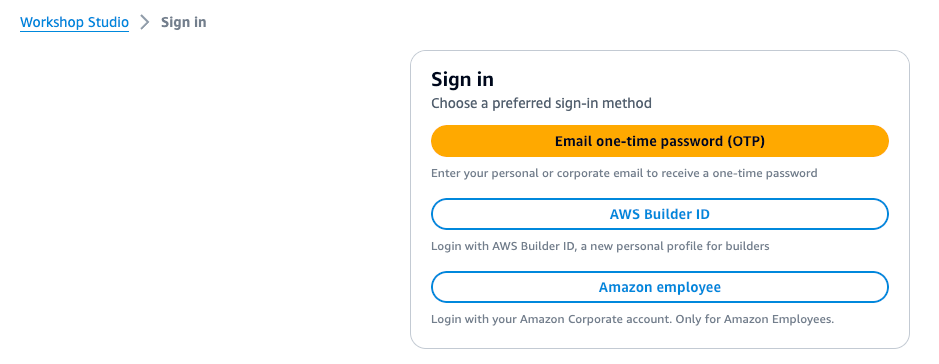
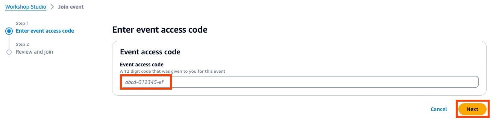
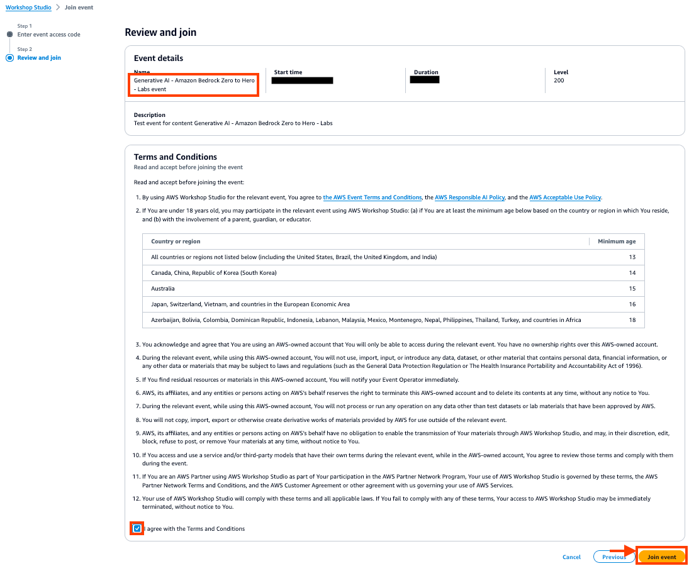
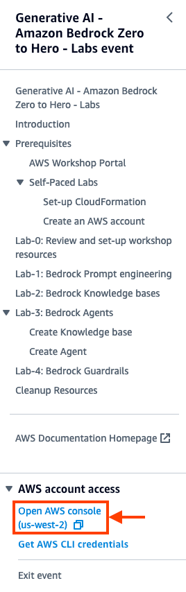
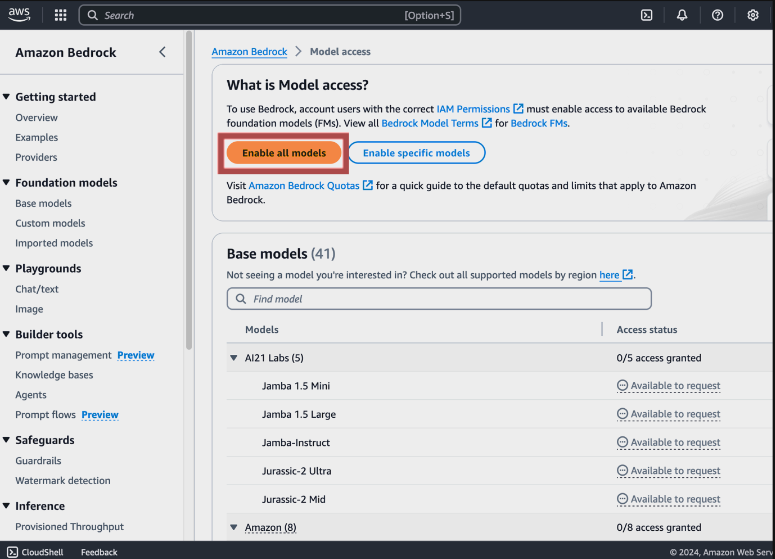
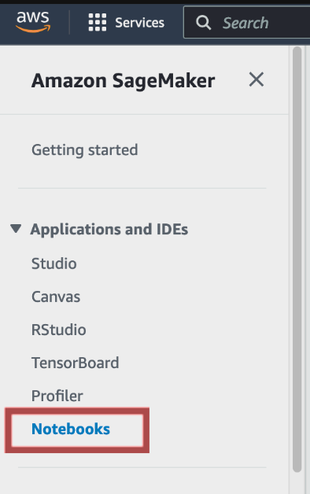
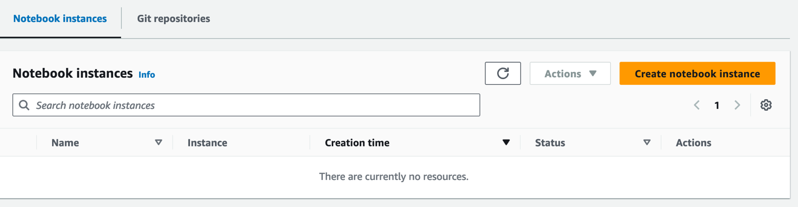
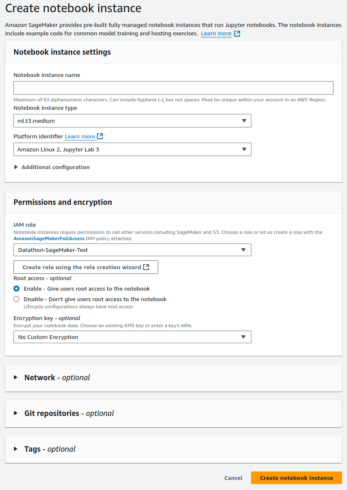
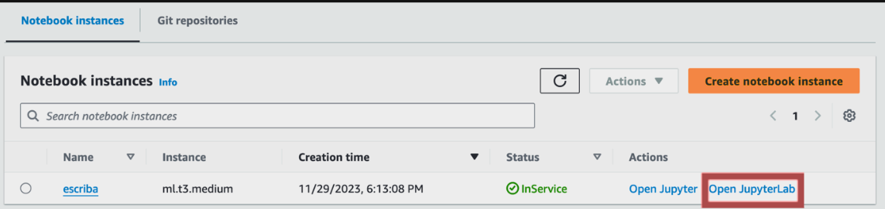

# GenAI Health Hackathon

GenAI Health Hackathon 2024 is an event created by Hospital Clínic de Barcelona with has the objective of exploring generative AI in the medical field. 

This document is divided in the following sections:
    1. Event rules
    2. Git contents
    3. AWS environment

**IMPORTANT: Please read this document carefully.**

## 1. Event rules
All participants in this event must comply with the following conditions:
- The development of the challenge  must be done using AWS services. The available services are:
    - S3
    - Bedrock 
    - Kendra
    - SageMaker (Jupyter Notebook)

NOTE: You can employ libraries like [LangChain](https://www.langchain.com/) in Jupyter Notebook (SageMaker) but always using AWS services.

- It is **NOT** allowed to extract/move information outside of the locations specified in the challenge files.

- The challenge will only be accepted if the participants save ALL the needed files to replicate the provided solution.

## 2. Git content

- *Challenges* (folder): contains the documentation for every challenge. These are the assigned challenges to each group:

|TEAM | CHALLENGE | TITLE |
|:-:|:-:|---|
0|17| Non-structured data extraction from release reports to predict re-admission risk and death during the transactional attention
1|24|Optimizing Psychiatric Diagnosis and Patient Profiling through AI-Driven Textual Data Extraction and Analysis
2|1|Clinical History of Pain
3|29|Chatbot for Hospital Clinic website
4|9| Personalized Delivery of Nutrition Tips for Prehabilitation Patients
5|15|Large Language Models in the Prediction of Malignant Cerebral Infarction
6|23|Diagnostic Management of Infection in Febrile Neutropenia Patients
7|10|LLM comparison against ontologies for the patient's safety improvement with medication use
8|18|AI-guided Virtual Medical Simulation (MediRol)
9|31|Optimizing Precision Oncology in the Clinic Comprehensive Cancer Center with Generative AI (OPERA Project)
10|27|Evaluation of LLM Performance in Assessing the Appropriateness of Outpatient Colonoscopy Requests According to Current Guidelines
11|33|IRB Screening Agent
12|28|Querying a database using natural language

2. *Demos* (folder): contains tutorials to help the participants to develop the assigned challenge in AWS environment. Each challenge specifies the demos that can be used.

3. *EvaluationCriteria.pdf*: contains the criteria that will be used on the challenge evaluation.

## 3. AWS environment
### 3.1 Access to your account environment
Workshop Studio has provisioned a dedicated, temporary AWS account for every team participating. You will need the Participant Hash provided upon entry, and your email address to track your unique session.

1. Open Workshop Studio join event and follow the appropriate sign-in method. For this event: "email one-time password".

2. Enter the provided event access code.

3. In Review and join step, click join event

4. This will take you to the Workshop, click "Open AWS console" to connect to your AWS Account

### 3.2. Environment setup
Now you are logged-in in your team’s aws account.

You are sharing this environment with the rest of your team, and the following steps only need to be applied by **one of the team members**.
#### 3.2.1. Activate Foundational Models in Amazon Bedrock
From aws console, navigate to Amazon Bedrock.

- In the left column, scroll down and, at the bottom, click on the option “Model access”.

- In the model access menu, click on enable all models

#### 3.2.2. Create your Jupyter Notebook Instance.
The challenges have been designed to be developed with Jupyter Notebook in SageMaker. The procedure to open this service is detailed below. 

- From AWS console, navigate to Sagemaker service.

- In Sagemaker console, select "Notebooks" from the left panel.

- Click on “Create Notebook Instance”.

- Give your notebook instance a name, like "Your-name-notebook”.

Select an instance type, like "ml.t3.medium". This should be large enough in most cases.

If your notebook needs more resources, you can later change its instance type to a larger one like "c4.2xlarge" or a bigger one if you need it.

For platform identifier, choose “Amazon Linux 2, Jupyter Lab 3”

In the permissions section, for IAM role choose "WSParticipantRole"

Leave the rest of options by default.

Click on “Create notebook instance”

- Wait for the instance to be in status “InService”, and then access to it by clicking on “Open JupyterLab”.

